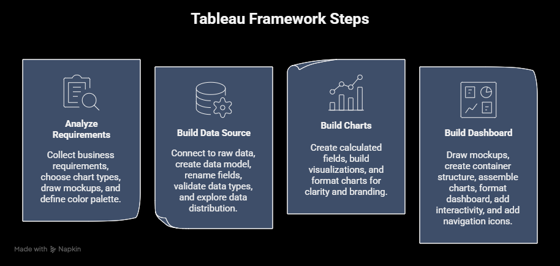

# Tableau Sales Project
### *Interactive Sales & Customer Insights Dashboard*


---

## 🚀 **Project Overview**
**The Goal:** To validate and refine a repeatable 4-Step Design Framework for analytics. This project serves as a proof-of-concept for a standardized workflow—moving from requirements gathering and mockups to data modeling and final visualization—ensuring consistency and speed in future work.

**The Solution:** Developed two interactive dashboards (Sales & Customer) using a strict **4-Step Design Framework**. The solution incorporates dynamic parameters for historical analysis, advanced Level-of-Detail (LOD) expressions, and a user-centric UX design.

**Key Metrics:**
* **Dashboards:** Sales & Customer Overview
* **Interactivity:** Dynamic Year Selection, Parameter Actions, Drill-downs
* **Tech Stack:** Tableau Desktop, CSV/Flat Files, Napkin.AI

---

## 🏗️ **Architecture: The 4-Step Framework**

I designed a **Reusability Framework** to ensure consistency and speed for this and future projects. This framework prevents "blank canvas paralysis" by enforcing a structured workflow.



### **Step 1: Analyze Requirements**
*Focus: Alignment & Prototyping*
* **Collect:** Map business questions to specific KPIs.
* **Mockups:** Draw by hand mockups before touching Tableau. (it will save you time later)
* **Choose colors:** Define color logic (Max 4 colors) early to ensure consistency.

### **Step 2: Build Data Source**
*Focus: Modeling & Hygiene*
* **Model:** Create a Star Schema logic (Fact table + Dimension tables).
* **Validation:** Rename fields to business-friendly terms and validate data types (String vs Date) immediately upon connection.

### **Step 3: Build Charts**
*Focus: Visual Logic*
* **Calculations:** Create and test Calculated Fields (YoY, LODs) before visualization.
* **Formatting:** Apply "Minimalist Protocol" (Remove lines/grids, clean axes, simplified tooltips).

### **Step 4: Build Dashboard**
*Focus: Layout & Interactivity*
* **Containers:** Draft container structure (Tiled vs Floating) to ensure responsiveness.
* **Padding:** Apply consistent inner/outer padding for visual breathing room.
* **Interactivity:** Add filters, dynamic parameters, and navigation buttons.

---

## 🛠️ **Technical Implementation**

### **1. Data Modeling: The Foundation**
* **Star Schema Logic:** Connected the `Orders` table (Fact) with `Products` and `Location` (Dimensions) inside Tableau to ensure accurate aggregation at different levels of granularity.

### **2. Calculation Logic: Time Intelligence & LODs**
To move beyond basic sums, I engineered several advanced calculations:

* **Dynamic Year-Over-Year (YoY) Logic:**
    Instead of hardcoding dates, I used Parameters to allow users to select a "Current Year," dynamically recalculating the "Previous Year."
    ```sql
    -- Logic for Previous Year Sales based on User Selection
    IF YEAR([Order Date]) = [Select Year]-1 THEN [Sales]
    END
    ```

* **Customer Frequency (LOD Expression):**
    Used `{FIXED}` expressions to categorize customers by their purchase frequency, independent of the dashboard view filters.
    ```sql
    -- Number of Orders per Customer
    {FIXED [CY Customers Nr.]: COUNTD([CY Orders])}
    ```

* **Dynamic Benchmarking:**
    Used `WINDOW_AVG()` to create dynamic reference lines that adjust based on the filtered data view.

---

## 🔄 **Standardization & Reusability**
*My Philosophy: "Build a system, not just a dashboard."*

The core value of this project is not just the final output, but the **Design Protocol** created alongside it. I have documented this workflow into a reusable checklist in my Obsidian vault 
that I apply to every new visualization challenge to ensure high-quality delivery.

---

## 📊 **Dashboard Views**

### **1. Sales Dashboard**
*Executive view for Year-over-Year performance.*
* **KPIs:** Total Sales, Profit, and Quantity with YoY growth rates.
* **Logic:** Features a dual-axis sparkline comparing Current Year vs. Previous Year trends, with automatic highlighting of monthly highs and lows.

### **2. Customer Dashboard**
*Marketing view for segmentation and behavior analysis.*
* **Segmentation:** Distributes customers based on order frequency (Loyalty analysis).
* **Top Performers:** A ranked view of the Top 10 Customers by profit, providing actionable leads for account managers.

---

## 🔍 **Live Demo**
This repository focuses on the **documentation and logic**. To experience the full interactivity:

👉 **[View the Interactive Dashboard on Tableau Public](https://public.tableau.com/app/profile/miroslav.kopac/viz/PortfolioProject1_17373657626930/SalesDashboard)**

---

## 👏 **Acknowledgements & Learning**
* **Mentorship:** This project was built under the guidance of **[Data with Baraa](https://www.youtube.com/@DataWithBaraa)**. I followed his structured curriculum to apply real-world analytics practices derived from his experience at **Mercedes-Benz**.
* **Technical Mastery:** Learned to manipulate **Tableau Table Calculations** (`WINDOW_MAX`, `RANK`) and **Parameters** to create user-driven experiences.
* **Design Discipline:** The biggest takeaway was the discipline of **drawing mockups first**, which significantly reduced development time and resulted in a cleaner container structure.
---

## 📬 **Contact**
**Miroslav Kopac** *Data Analyst* [LinkedIn](https://www.linkedin.com/in/miroslavkopac/) | [Email](mailto:kopacmiroslav@gmail.com)

  
